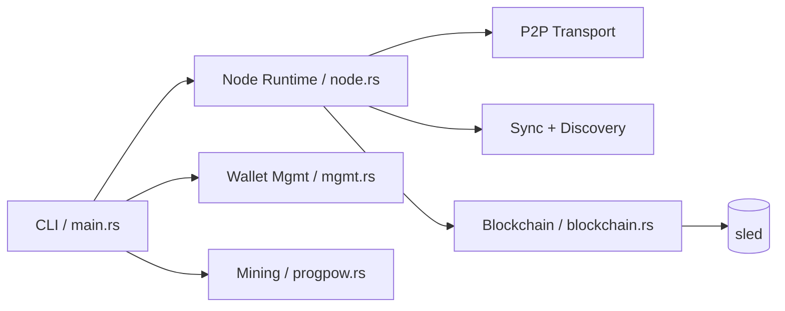

# alphanumeric
https://www.alphanumeric.blue/


[](#build-and-run)
[](#operations-checklist)
[](#license)

`alphanumeric` is a Rust blockchain node runtime with integrated networking, wallet management, mining, and diagnostics tooling.

## Quick Nav

- [System Goals](#system-goals)
- [Technical Architecture](#technical-architecture)
- [Build and Run](#build-and-run)
- [Configuration via Environment Variables](#configuration-via-environment-variables)
- [CLI Surface](#cli-surface)
- [Security Posture](#security-posture)

## System Goals

`alphanumeric` is designed as a single-node executable that bundles the full operational stack needed to participate in a live network:

- deterministic local chain-state persistence (`sled`)
- bounded, framed P2P messaging with peer lifecycle management
- block/transaction propagation and sync workflows
- integrated mining path
- wallet/key workflows plus operator CLI
- local operational telemetry and diagnostics

## Non-Goals (Current)

- protocol stability guarantees across all commits
- audited production security claims
- strict long-term API/CLI compatibility guarantees

## Current Status

- Active development.
- Interfaces and internals can change between commits.
- Not a formally audited production system.

## Capability Matrix

| Capability | Scope |
| --- | --- |
| Node runtime | Listener, peer connect/disconnect, maintenance loops |
| P2P transport | Length-prefixed framed messaging, bounded payloads |
| Sync | Peer block-range requests and ingestion |
| Persistence | Embedded `sled` storage and local bootstrap |
| Mining | Local mining manager and miner workflows |
| Wallet ops | Create/rename/list/history/account + transaction creation |
| Ops visibility | Status/sync/connect/discovery commands + stats server hooks |

## Technical Architecture

High-level module map:

- `src/main.rs`: process entrypoint, bootstrap, CLI loop, network command handling
- `src/a9/node.rs`: P2P runtime, framing, peer management, sync, event handling
- `src/a9/blockchain.rs`: block/transaction validation and persistence
- `src/a9/mgmt.rs`: wallet management and key workflow
- `src/a9/progpow.rs`: mining manager and mining flow
- `src/a9/velocity.rs`: velocity/shred propagation support
- `src/a9/bpos.rs`: sentinel/validator-related logic
- `src/a9/whisper.rs`: whisper messaging support

Runtime shape:

1. bootstrap/load DB (`blockchain.db`)
2. initialize blockchain state
3. initialize node runtime + listeners
4. spawn background tasks:
   - peer maintenance
   - discovery/announce
   - sync
   - optional stats
5. process interactive commands and network events



## Network and Protocol Notes

- Default node TCP port: `7177` (`DEFAULT_PORT` in `src/a9/node.rs`)
- Outbound messaging uses framed transport (length-prefixed payloads)
- Message size limits are enforced (`MAX_MESSAGE_SIZE`)
- Outbound connection pooling is enabled with:
  - idle cleanup
  - LRU-style eviction
  - per-peer circuit breaker on repeated failures
- Inbound connection handling is concurrency-limited
- DNS/discovery endpoints are environment-configurable

## Consensus and Validation

The codebase includes multiple consensus/validation-related components (PoW/mining path, sentinel/validator logic, and propagation optimizations). Behavior is defined by the current code paths in `src/a9/*`.

If you are integrating against this repository, pin a commit hash and validate behavior at that exact revision.

## Build and Run

Prerequisites:

- Rust stable toolchain
- Cargo

Build:

```powershell
cargo build --release
```

Run:

```powershell
cargo run --release
```

## Bootstrap and Storage

Startup bootstrap source (default):

- `https://alphanumeric.blue/bootstrap/blockchain.db.zip`

If `blockchain.db` already exists locally, that state is used.

Primary local artifacts:

- `blockchain.db`
- `private.key`
- optional lock files (`*.lock`)

## Configuration via Environment Variables

Common variables used by the runtime include:

- `ALPHANUMERIC_BIND_IP`
- `ALPHANUMERIC_BOOTSTRAP_PUBLISH_TOKEN` (optional: enables bootstrap publishing + the `push` command for the canonical publisher node)
- `ALPHANUMERIC_IGNORE_DB_LOCK`
- `ALPHANUMERIC_STATS_ENABLED`
- `ALPHANUMERIC_STATS_BIND`
- `ALPHANUMERIC_STATS_PORT`
- `ALPHANUMERIC_DNS_SEEDS`
- `ALPHANUMERIC_DISCOVERY_BASE`
- `ALPHANUMERIC_DISCOVERY_BASES`
- `ALPHANUMERIC_DISCOVERY_URL`
- `ALPHANUMERIC_ANNOUNCE_URL`
- `ALPHANUMERIC_HEADERS_URL`
- `ALPHANUMERIC_PUBLIC_IP`
- `ALPHANUMERIC_ENABLE_UPNP`
- `ALPHANUMERIC_PEER_CACHE_PATH`
- `ALPHANUMERIC_TX_WITNESS_CACHE_SIZE`

## CLI Surface

Interactive command loop examples:

- `create <sender> <recipient> <amount>`
- `whisper <address> <msg>` (amount can be provided depending on flow)
- `balance`
- `new [wallet_name]`
- `account <address>`
- `history`
- `rename <old_name> <new_name>`
- `mine <wallet_name>`
- `info`
- `diagnostics`

Process flags/network commands:

- `--status` or `-s`
- `--sync`
- `--sync --force`
- `--connect <ip:port>`
- `--getpeers`
- `--discover`

## Security Posture

This project handles key material and peer input. Treat it accordingly.

- `private.key` is sensitive. Secure the host and filesystem permissions.
- Do not commit key material to source control.
- Treat all network input as untrusted.
- Validate operational assumptions before mainnet-like usage.

## Operations Checklist

Minimum recommended setup for a reachable node:

1. open TCP port `7177` on host firewall/router
2. run node on a stable host with persistent disk
3. monitor logs and peer count
4. back up sensitive key material securely

Windows firewall example:

```powershell
New-NetFirewallRule -Name "Alphanumeric Network" -DisplayName "Alphanumeric Network (Port 7177)" -Protocol TCP -LocalPort 7177 -Direction Inbound,Outbound -Action Allow
```

## Development Workflow

Quick local checks:

```powershell
cargo check
```

When changing protocol/runtime code, prefer:

- explicit message framing
- bounded buffers and timeouts
- clear lock scopes
- deterministic error handling

## Frontend

- Official frontend: https://www.alphanumeric.blue/

## Community

- Discord: https://discord.gg/D3r7TRcj9t

## License

MIT
