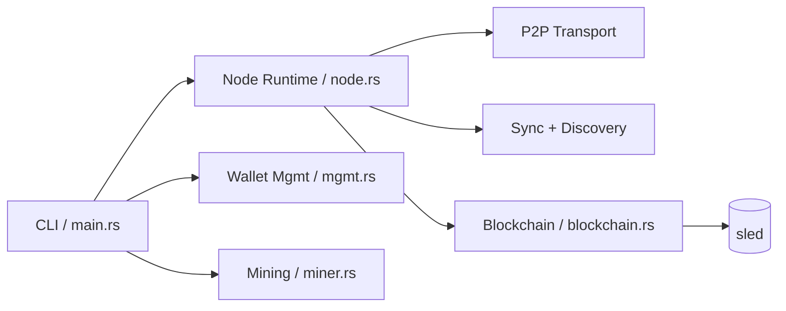

# alphanumeric


[](#build-and-run)
[](#supported-platforms)
[](#license)

https://www.alphanumeric.blue/

Rust blockchain node and command-line wallet client for macOS/OSX, Linux, and Windows.

`alphanumeric` is a Rust blockchain node runtime with integrated peer discovery, wallet management, mining, local chain storage, bootstrap sync, and diagnostics tooling. The current release line is `7.9.4`.

## Quick Nav

- [System Goals](#system-goals)
- [Technical Architecture](#technical-architecture)
- [Tokenomics](#tokenomics)
- [Supported Platforms](#supported-platforms)
- [Build and Run](#build-and-run)
- [Bootstrap and Storage](#bootstrap-and-storage)
- [Configuration via Environment Variables](#configuration-via-environment-variables)
- [CLI Surface](#cli-surface)
- [GPU Mining](docs/GPU_MINING.md)
- [Security Posture](#security-posture)

## System Goals

`alphanumeric` is designed as a single-node executable that bundles the full operational stack needed to participate in a live network:

- deterministic local chain-state persistence (`sled`)
- bounded, framed P2P messaging with peer lifecycle management
- block/transaction propagation and sync workflows
- integrated mining path
- wallet/key workflows plus operator CLI
- local operational telemetry and diagnostics

## Non-Goals (Current)

- protocol stability guarantees across all commits
- audited production security claims
- strict long-term API/CLI compatibility guarantees

## Current Status

- Active development.
- Interfaces and internals can change between commits.
- Extensively reviewed and tested through internal adversarial and AI-assisted
  hardening. This is not a third-party audit or a guarantee that no defects remain.
- macOS/OSX release packaging is supported for the command-line client.

## Supported Platforms

The client is intended to run on:

- macOS/OSX, including Apple Silicon release builds
- Linux
- Windows

The repository can be built from source with the Rust stable toolchain. Release zips may include a more user-focused `README.md` from `release/README.md`; this repository README is the technical project overview.

## Capability Matrix

| Capability | Scope |
| --- | --- |
| Node runtime | Listener, peer connect/disconnect, maintenance loops |
| P2P transport | Length-prefixed framed messaging, bounded payloads |
| Sync | Peer block-range requests and ingestion |
| Persistence | Embedded `sled` storage and local bootstrap |
| Mining | Local mining manager and miner workflows |
| Wallet ops | Create/rename/list/history/account + transaction creation |
| Ops visibility | Status/sync/connect/discovery commands + stats server hooks |

## Technical Architecture

High-level module map:

- `src/main.rs`: process entrypoint, bootstrap, CLI loop, network command handling
- `src/a9/node.rs`: P2P runtime, framing, peer management, sync, event handling
- `src/a9/blockchain.rs`: block/transaction validation and persistence
- `src/a9/mgmt.rs`: wallet management and key workflow
- `src/a9/miner.rs`: mining manager and mining flow
- `src/a9/velocity.rs`: velocity/shred propagation support
- `src/a9/bpos.rs`: sentinel/validator-related logic
- `src/a9/whisper.rs`: whisper messaging support

Runtime shape:

1. bootstrap/load DB (`blockchain.db`)
2. initialize blockchain state
3. initialize node runtime + listeners
4. spawn background tasks:
   - peer maintenance
   - discovery/announce
   - sync
   - optional stats
5. process interactive commands and network events


```mermaid
flowchart LR
    CLI[CLI / main.rs] --> NODE[Node Runtime / node.rs]
    NODE --> P2P[P2P Transport]
    NODE --> SYNC[Sync + Discovery]
    NODE --> CHAIN[Blockchain / blockchain.rs]
    CHAIN --> DB[(sled)]
    CLI --> MGMT[Wallet Mgmt / mgmt.rs]
    CLI --> MINER[Mining / miner.rs]
```

## Network and Protocol Notes

- Default node TCP port: `7177` (`DEFAULT_PORT` in `src/a9/node.rs`)
- Outbound messaging uses framed transport (length-prefixed payloads)
- Message size limits are enforced (`MAX_MESSAGE_SIZE`)
- Outbound connection pooling is enabled with:
  - idle cleanup
  - LRU-style eviction
  - per-peer circuit breaker on repeated failures
- Inbound connection handling is concurrency-limited
- DNS/discovery endpoints are environment-configurable
  - Primary peer bootstrap: `ALPHANUMERIC_DISCOVERY_BASE` (default `https://alphanumeric.blue`)
  - Optional DNS fallback seeds: `ALPHANUMERIC_DNS_SEEDS` (comma-separated `host:port`)

## Consensus and Validation

The codebase includes multiple consensus/validation-related components (PoW/mining path, sentinel/validator logic, and propagation optimizations). Behavior is defined by the current code paths in `src/a9/*`.

Transaction witnesses use a compact-finality model:

- live mempool and new block admission require the full ML-DSA signature and sender public key
- confirmed block storage keeps a compact signature receipt plus `sig_hash = SHA256(full_signature)`
- historical P2P sync validates block hash, merkle root, PoW, balances, reward rules, public-key/address binding, and receipt commitments without requiring archived full witnesses

Difficulty maps to PoW work in discrete power-of-two bands (the target is
`MAX_TARGET >> (difficulty / 16)`), so the retarget adjusts real work in factor-of-two
steps rather than continuously. At hashrates that fall between two bands, observed block
time can sawtooth around the `TARGET_BLOCK_TIME` (faster in the lower band, slower in the
higher one) until difficulty or hashrate settles. This is expected and self-correcting —
it does not affect finality (reorgs remain bounded by the checkpoint margin) — and finer
target granularity is a candidate for a future coordinated protocol upgrade.

If you are integrating against this repository, pin a commit hash and validate behavior at that exact revision.

### Scheduled compatibility boundary

Client `7.9.4` activates updated reward accounting at block `569,423`.
Pre-activation blocks retain the existing rules. Miners, pools, public nodes, and
other validating operators must upgrade before the activation height; older
software may not agree on block validity after that point. The node announces an
advisory consensus fingerprint so operators can monitor rollout compatibility.

## Tokenomics

### Supply Summary (Simple)

- There is **no fixed hard cap** encoded as a single number.
- New issuance **decays over time**:
  - max block reward drops by **17% every 6 months** (`* 0.83` each period)
- In practice this creates **asymptotic supply behavior**:
  - total supply can continue to increase
  - but new issuance becomes progressively smaller over time
- Launch genesis is dated **2026-07-04 UTC**. Any forward supply projection must
  state its starting height/time, assumed block cadence, and transaction-fee
  activity; an undated “max supply from now” estimate is not authoritative.

### Runtime Parameters (Current Code)

- Reference-wallet fee: automatic, priced off the live mempool
  (`Blockchain::fee_estimate`): a flat `0.0002` anchor (2x the relay floor) on
  a quiet network, one unit above the marginal next-block fee under
  congestion, always capped at `0.002` for an automatic fee (`0.01` remains the
  ceiling for an explicitly chosen `--fee`)
- `FEE_PERCENTAGE = 0.000563063063` remains the Whisper encoding constant; it is
  not the regular-wallet fee policy
- Reward constants: `MIN_BLOCK_REWARD = 1.0`, launch
  `MAX_BLOCK_REWARD = 50.0`; the effective subsidy ceiling decays by 17% every
  six months and eventually falls below the nominal floor
- Reward network fee: `NETWORK_FEE = 0.0005`
- Fee clipping factor: `MINT_CLIP = 0.35`
- Target block time: `TARGET_BLOCK_TIME = 5` seconds
- Empty-block rewards are clamped from `0.2 * current_max` into
  `[min(MIN_BLOCK_REWARD, current_max), current_max]`
- Before block `569,423`, non-empty block rewards retain the legacy fee curve.
  From block `569,423`, miner compensation is the scheduled subsidy plus 65% of
  included transaction fees; the remaining 35% is burned. The decaying ceiling
  bounds the subsidy component, while exact fee units are transferred separately.

Actual realized issuance still depends on real network activity (block production + transaction fees).

## Build and Run

Prerequisites:

- Rust stable toolchain
- Cargo
- macOS/OSX: Xcode Command Line Tools (`xcode-select --install`) if a local compiler toolchain is missing

Build:

```bash
cargo build --release
```

Run:

```bash
cargo run --release
```

Run the built binary directly:

```bash
./target/release/alphanumeric
```

For a cleaner local install, keep the binary in a dedicated folder and always run it from that folder, or set `ALPHANUMERIC_DB_PATH` explicitly.

## Bootstrap and Storage

Startup bootstrap source (default):

- The signed manifest at `https://alphanumeric.blue/api/bootstrap/manifest`; the snapshot download URL is taken from that signed manifest (there is no fixed static download path).

Bootstrap trust mode:

- Nodes prefer manifest bootstrap from `https://alphanumeric.blue/api/bootstrap/manifest`.
- The manifest is signature-verified before use.
- If manifest retrieval/parsing/verification fails, startup fails closed by default.
- Bootstrap is manifest-verified and fails closed on verification failure; there is no override to bypass verification.

Launch-network guard:

- `blockchain.db` is reused only when block `0` matches the frozen launch genesis/network ID.
- If a local DB belongs to a different network, has a bad genesis, or cannot be read, startup replaces it from the signed bootstrap.
- Wallet keys are separate from chain state; keeping `private.key` preserves wallet identity, but balances are always calculated from the verified launch-chain DB.
- `ALPHANUMERIC_FORCE_BOOTSTRAP=true` forces replacement from the signed bootstrap even when the local DB is already valid.

Default storage behavior:

- `ALPHANUMERIC_DB_PATH` controls the chain database path.
- Without `ALPHANUMERIC_DB_PATH`, the default relative path is `blockchain.db`.
- Relative paths resolve under the current working directory, unless an existing launch-network DB or stale DB is found beside the executable and needs to be reused/replaced.
- For normal users, a dedicated folder such as `~/Alphanumeric` is recommended.

Primary local artifacts:

- `blockchain.db`
- `private.key`
- `node_identity.key`
- optional lock files (`*.lock`)

## Configuration via Environment Variables

Common variables used by the runtime include:

- `ALPHANUMERIC_BIND_IP`
- `ALPHANUMERIC_DB_PATH`
- `ALPHANUMERIC_HEADLESS` (`true` runs node services without the interactive command loop)
- `ALPHANUMERIC_FORCE_BOOTSTRAP`
- `ALPHANUMERIC_IGNORE_DB_LOCK`
- `ALPHANUMERIC_STATS_ENABLED`
- `ALPHANUMERIC_STATS_BIND` (default `127.0.0.1`; set `0.0.0.0` only when the stats API should be public)
- `ALPHANUMERIC_STATS_PORT`
- `ALPHANUMERIC_SEED_NODES` or `ALPHANUMERIC_BOOTSTRAP_PEERS` (comma-separated `host:port` peers tried before relying on gateway fallback)
- `ALPHANUMERIC_DNS_SEEDS`
- `ALPHANUMERIC_DISCOVERY_BASE`
- `ALPHANUMERIC_DISCOVERY_BASES`
- `ALPHANUMERIC_ALLOW_PRIVATE_PEERS` (default off; use only for local/private test networks)
- `ALPHANUMERIC_DISCOVERY_URL`
- `ALPHANUMERIC_ANNOUNCE_URL`
- `ALPHANUMERIC_HEADERS_URL`
- `ALPHANUMERIC_ANNOUNCE_INTERVAL_SECS` (default `300`, minimum `60`)
- `ALPHANUMERIC_ENABLE_HEADER_SNAPSHOTS` (default off; enable on trusted publisher/validator nodes only)
- `ALPHANUMERIC_HEADER_SNAPSHOT_INTERVAL_SECS` (default `30`, minimum `15`, maximum `3600`)
- `ALPHANUMERIC_ENABLE_STATS_SNAPSHOTS` (default off; enable on trusted publisher/validator nodes only)
- `ALPHANUMERIC_STATS_SNAPSHOT_INTERVAL_SECS` (default `300`, minimum `60`)
- Relay publishing and relay sync are **always on** and have no toggle. They are how a node
  reaches the chain when direct peers are unreachable, so they are not opt-in.
- `ALPHANUMERIC_RELAY_SYNC_BACKFILL_DEPTH` (default `64`, the checkpoint reorg margin; max `256`)
- `ALPHANUMERIC_RELAY_SYNC_MAX_ROUNDS` (default `4`, max `24`)
- `ALPHANUMERIC_PUBLIC_IP`
- `ALPHANUMERIC_PEER_CACHE_PATH`
- `ALPHANUMERIC_TX_WITNESS_CACHE_SIZE`

Official bootstrap snapshots are accepted only when the blue gateway returns a pinned publisher manifest with a valid signature and SHA-256. New manifests also carry signed compressed size, extracted size, and file count metadata so the node can preflight disk space and verify extraction without imposing a fixed chain-size ceiling.

Bootstrap publishing is maintainer infrastructure, not part of normal macOS node setup. Operator-level details are kept in [docs/BOOTSTRAP_PUBLISHER.md](docs/BOOTSTRAP_PUBLISHER.md).

## CLI Surface

Interactive command loop examples:

- `create <sender> <recipient> <amount> [--fee <ALPHA>]`
- `whisper <address> <msg>` (amount can be provided depending on flow)
- `balance`
- `new [wallet_name]`
- `account [address_or_wallet_name]` (bare: your default wallet)
- `history`
- `rename <old_name> <new_name>`
- `mine [wallet_name] [--continuous]` (bare: your default wallet; the GPU build adds `[--gpu|--cpu]`)
- `info`
- `debug`

With no `--fee`, the wallet prices the fee automatically off the live mempool
(the `info` screen shows the current value as `Default Fee`, and `create`
prints the resolved `Auto fee` before signing): a flat `0.0002` anchor when the
network is quiet, one unit above the marginal next-block fee under congestion,
never above `0.002` for an automatic fee. Exchanges and other
automated operators can select an absolute fee with `--fee`; values must meet
the `0.0001` relay floor. The CLI refuses an explicit fee above `0.01` as a
hard safety ceiling. This is reference-wallet policy, not a universal network
limit; externally signed integrations retain control of their fee policy
subject to current node admission and block-accounting rules (integrators can
query `GET /explorer/fee-estimate` for the same recommendation).

Network commands (at the REPL prompt):

- `--status`
- `--sync`
- `--connect <ip:port>`
- `--getpeers`
- `--discover`

## Security Posture

This project handles key material and peer input. Treat it accordingly.

- `private.key` is sensitive. Secure the host and filesystem permissions.
- Do not commit key material to source control.
- Treat all network input as untrusted.
- Validate operational assumptions before mainnet-like usage.

## Operations Checklist

Minimum recommended setup for a reachable node:

1. open TCP port `7177` on host firewall/router
2. run node on a stable host with persistent disk
3. monitor logs and peer count
4. back up sensitive key material securely

Windows firewall example:

```powershell
New-NetFirewallRule -Name "Alphanumeric Network" -DisplayName "Alphanumeric Network (Port 7177)" -Protocol TCP -LocalPort 7177 -Direction Inbound,Outbound -Action Allow
```

macOS/OSX firewall note:

- If the macOS firewall prompts for incoming connections, allow `alphanumeric` if this machine should accept peers.
- If Gatekeeper blocks a downloaded release binary, right-click the binary in Finder and choose Open, or remove the quarantine attribute with `xattr -dr com.apple.quarantine ./alphanumeric`.

## Development Workflow

Quick local checks:

```bash
cargo check
```

When changing protocol/runtime code, prefer:

- explicit message framing
- bounded buffers and timeouts
- clear lock scopes
- deterministic error handling

Threat model and control mapping:

- `docs/THREAT_MODEL.md`

## Frontend

- Official frontend: https://www.alphanumeric.blue/

## Community

- Discord: https://discord.gg/D3r7TRcj9t

## License

MIT
